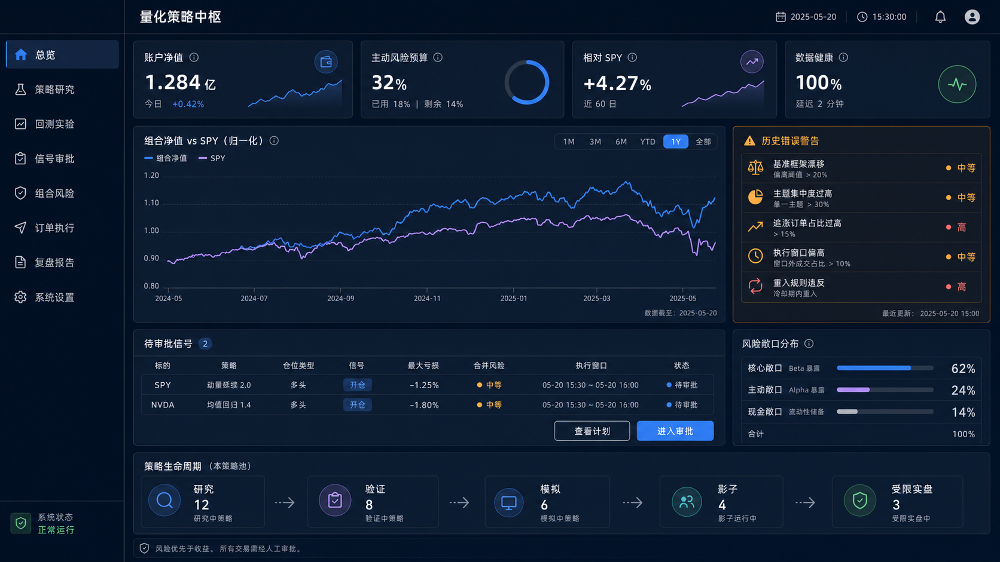

# 网页产品设计与 WorkBuddy 交接规范

> 版本：v0.1  
> 日期：2026-07-26  
> 状态：产品与前端框架设计，不包含生产代码  
> 设计稿：[桌面端总览设计图](./design/quant-system-dashboard-v1.png)



## 1. 产品定位

网页是量化策略核心系统的操作台，不是行情终端，也不是直接刺激交易的下单面板。

它应当让用户沿着固定流程工作：

```text
研究
→ 回测
→ 验证
→ 模拟
→ 影子运行
→ 交易提案
→ 风险检查
→ 人工审批
→ 订单执行
→ 对账和复盘
```

页面的首要问题是：

1. 数据是否可信；
2. 策略是否通过验证；
3. 当前风险是否允许；
4. 为什么产生这笔交易；
5. 这笔交易最大可能损失多少；
6. 是否正在重复历史错误；
7. 执行后是否能够完整对账。

收益展示的视觉权重不能高于风险、数据质量和执行状态。

## 2. 视觉方向

设计关键词：

- 冷静；
- 机构化；
- 可审计；
- 中高信息密度；
- 风险优先；
- 人工审批明确；
- 避免赌场和加密货币交易所风格。

设计稿采用深色桌面端布局：

- 左侧固定导航；
- 顶部系统与市场状态；
- 12 栏主内容区；
- 蓝色表示组合或主要动作；
- 紫色表示基准；
- 绿色只表示已经验证通过的正常状态；
- 黄色表示需要注意或人工确认；
- 红色只表示硬阻断和严重风险。

设计图中的数值均为视觉示例，不能进入开发 fixtures 以外的任何真实环境。

## 3. 信息架构

```mermaid
flowchart TB
    APP["量化策略中枢"]
    APP --> O["总览"]
    APP --> R["策略研究"]
    APP --> B["回测实验"]
    APP --> A["信号审批"]
    APP --> K["组合风险"]
    APP --> E["订单执行"]
    APP --> V["复盘报告"]
    APP --> S["系统设置"]

    R --> R1["策略注册表"]
    R --> R2["策略 Manifest"]
    R --> R3["因子与模型实验"]

    B --> B1["回测运行"]
    B --> B2["结果比较"]
    B --> B3["订单账本"]
    B --> B4["数据与执行假设"]

    A --> A1["待审批信号"]
    A --> A2["交易计划"]
    A --> A3["历史错误警告"]
    A --> A4["批准或拒绝"]

    K --> K1["账户风险"]
    K --> K2["主题与相关性"]
    K --> K3["风险预算"]
    K --> K4["停止新增风险"]

    E --> E1["订单意图"]
    E --> E2["券商订单"]
    E --> E3["成交与持仓"]
    E --> E4["对账异常"]

    V --> V1["策略归因"]
    V --> V2["基准比较"]
    V --> V3["规则外交易"]
    V --> V4["历史问题更新"]
```



## 4. 路由框架

| 路由 | 页面 | 主要职责 | 是否允许产生交易动作 |
|---|---|---|---|
| `/overview` | 总览 | 账户、策略、风险和系统状态 | 否 |
| `/research/strategies` | 策略研究 | 查看策略注册表和生命周期 | 否 |
| `/research/strategies/:id` | 策略详情 | Manifest、参数、样本和版本 | 否 |
| `/backtests` | 回测实验 | 运行列表、筛选和比较 | 否 |
| `/backtests/:runId` | 回测详情 | 绩效、基准、成本、订单账本 | 否 |
| `/approvals` | 信号审批 | 待审批提案列表 | 只能进入审批 |
| `/approvals/:planId` | 审批详情 | 风险检查、历史警告、批准/拒绝 | 是，必须人工确认 |
| `/risk` | 组合风险 | 风险预算、暴露、回撤和阻断状态 | 只允许停止新增风险 |
| `/execution` | 订单执行 | 订单意图、券商订单和成交状态 | 不允许绕过审批新增订单 |
| `/reviews` | 复盘报告 | 策略与行为复盘 | 否 |
| `/settings` | 系统设置 | 数据源、券商、通知和环境 | 否 |

首版不提供独立的“快捷交易”页面。

## 5. 全局页面框架

### 5.1 App Shell

```text
┌───────────────────────────────────────────────────────────────┐
│ Sidebar │ Top Header                                          │
│         ├─────────────────────────────────────────────────────│
│         │ Breadcrumb / Page Title / Page Actions              │
│         ├─────────────────────────────────────────────────────│
│         │                                                     │
│         │ Main Content                                        │
│         │                                                     │
│         ├─────────────────────────────────────────────────────│
│         │ Optional system status strip                        │
└───────────────────────────────────────────────────────────────┘
```

桌面端：

- Sidebar：232px；
- Header：56px；
- 页面水平内边距：24px；
- 内容最大宽度：不限制，但超过 1920px 时居中并限制单卡片宽度；
- 卡片间距：16px；
- 主网格：12 columns；
- 页面滚动，Sidebar 和 Header 固定。

### 5.2 Sidebar

固定顺序：

1. 总览；
2. 策略研究；
3. 回测实验；
4. 信号审批；
5. 组合风险；
6. 订单执行；
7. 复盘报告；
8. 系统设置。

底部固定显示：

- 系统运行状态；
- 数据最新时间；
- 当前环境：研究 / 模拟 / 影子 / 实盘。

当环境为实盘时，必须使用文字标签，不得只依赖颜色。

### 5.3 Top Header

显示：

- 当前市场日期与时区；
- 美股市场状态；
- 数据延迟；
- 未处理硬阻断数量；
- 通知入口；
- 用户菜单。

全局状态优先级：

```text
ACCOUNTING_BLOCKED
> BROKER_RECONCILIATION_FAILED
> DATA_BLOCKED
> RISK_BLOCKED
> DEGRADED
> HEALTHY
```

只显示最高优先级状态，同时允许展开查看全部问题。

## 6. 总览页面

设计图对应 `/overview`。

### 6.1 第一行 KPI

| 卡片 | 主值 | 辅助信息 | 点击后 |
|---|---|---|---|
| 账户净值 | 最新净值 | 日变化、更新时间 | 组合风险 |
| 主动风险预算 | 已用/剩余 | 主动仓风险额度 | 组合风险 |
| 相对 SPY | 固定窗口超额收益 | 窗口与费用后标识 | 回测/复盘 |
| 数据健康 | 通过率 | 延迟、异常数 | 系统设置/数据质量 |

规则：

- 账户净值必须带币种；
- 主动风险预算同时显示金额和净值比例；
- 相对收益必须标明时间窗口；
- 数据健康不能只显示百分比，要可展开异常项。

### 6.2 净值与基准

默认显示：

- 组合净值归一化曲线；
- SPY 归一化曲线；
- 可选 QQQ；
- 1M / 3M / 6M / YTD / 1Y / 全部；
- 费用后标记；
- 最后一个完整数据点。

悬浮信息：

- 日期；
- 组合净值；
- 基准净值；
- 累计超额；
- 当前回撤。

不默认显示预测价格或目标价。

### 6.3 历史错误警告

这是总览页最高风险权重卡片，固定标题：

`历史错误警告`

状态项：

- 基准与资金配置；
- 杠杆/反向产品；
- 单标的、期权或主题集中；
- 策略样本可重复性；
- 订单追价与改单；
- 执行时段；
- 清仓后再入场；
- 日线仓/周线仓分层；
- 强趋势尾仓计划。

每项显示：

- `PASS` / `WARN` / `HARD_BLOCK`；
- 一句话原因；
- 最近更新时间；
- 跳转到证据。

不能使用“风险得分 82”取代逐项结果。

### 6.4 待审批信号

表格字段：

- 标的；
- 策略；
- 策略版本；
- 仓位类型；
- 首次/再入场；
- 信号；
- 最大亏损金额；
- 最大亏损占净值；
- 同主题合并风险；
- 最早执行时间；
- 风险状态；
- 计划状态。

总览页只允许：

- 查看计划；
- 进入审批。

总览页不得出现直接买入、卖出或批准按钮。

### 6.5 风险敞口

显示：

- 核心仓；
- 主动仓；
- 现金；
- 特殊产品仓。

至少同时显示：

- 当前市值占比；
- 风险预算占比；
- 与目标区间差异。

不要把市值占比错误地称为风险占比。

### 6.6 策略生命周期

固定阶段：

```text
研究 → 验证 → 模拟 → 影子 → 受限实盘 → 实盘 → 退役
```

每个阶段显示策略数。点击进入带有该生命周期过滤条件的策略列表。

## 7. 策略研究页面

### 7.1 策略列表

字段：

- 策略名称；
- `strategy_id`；
- 当前版本；
- 生命周期；
- 市场与频率；
- 基准；
- 样本数；
- 最近样本外结果；
- 数据快照；
- 更新时间；
- 阻断原因。

主要动作：

- 创建策略草稿；
- 新建版本；
- 运行验证；
- 发起回测；
- 进入下一生命周期申请。

不能直接从研究状态部署实盘。

### 7.2 策略详情

Tab：

1. 概览；
2. Strategy Manifest；
3. 参数；
4. 信号定义；
5. 回测历史；
6. 样本与归因；
7. 版本差异；
8. 审计记录。

Manifest 可视化字段：

- code hash；
- 股票池；
- 订阅频率；
- 所需字段；
- warm-up；
- 基准；
- 允许方向；
- 最大产品能力；
- 因子/模型依赖。

页面必须同时展示 Deployment Policy，并说明它只能比 Manifest 更严格。

## 8. 回测实验页面

### 8.1 回测列表

筛选：

- 策略；
- 版本；
- 生命周期；
- 时间范围；
- 数据快照；
- 结果状态；
- 是否通过晋级标准。

比较功能最多同时选择 4 个运行，避免信息过载。

### 8.2 回测详情

顶部摘要：

- CAGR；
- 最大回撤；
- 对 SPY 超额；
- Sharpe/Calmar；
- 换手；
- 费用与滑点；
- 成交数；
- 同规则样本数；
- 最大盈利集中度。

Tab：

1. 净值与回撤；
2. 基准与市场状态；
3. 交易样本；
4. 标的/主题归因；
5. 订单账本；
6. 持仓快照；
7. 稳健性；
8. 数据来源；
9. 执行假设。

必须可见：

- `code_hash`；
- `config_hash`；
- `data_snapshot_id`；
- 信号生成和成交时序；
- commission/slippage；
- 被拒绝、延迟和未成交订单；
- 是否存在 open-position-only 或 no-signals。

## 9. 信号审批页面

### 9.1 审批详情布局

```text
┌────────────────────────────┬─────────────────────────┐
│ 交易计划                    │ 风险结论                │
│ 策略、信号、入场、退出      │ 最大亏损、合并风险      │
│ 仓位类型、持有期、尾仓      │ 风险规则逐项结果        │
├────────────────────────────┼─────────────────────────┤
│ 历史错误警告（全宽）                                  │
├───────────────────────────────────────────────────────┤
│ 数据与证据 / 策略样本 / 执行窗口 / 审计链             │
├───────────────────────────────────────────────────────┤
│ 拒绝计划 │ 要求修改 │ 批准计划                       │
└───────────────────────────────────────────────────────┘
```

### 9.2 必须显示的风险数字

- 当前账户净值；
- 计划数量；
- 入场价格区间；
- 失效价；
- 止损价；
- 最大亏损金额；
- 最大亏损占净值；
- 同标的风险；
- 同主题风险；
- 同方向合并风险；
- 最大持有期；
- 当前是否盘前盘后；
- 当前是否开盘后 30 分钟；
- 计划的最早执行时间。

如果任一必需数据缺失，不显示猜测值，统一显示：

`缺少数据，无法计算`

### 9.3 批准按钮条件

`批准计划` 默认禁用。只有以下条件全部满足才启用：

- 数据状态不是 BLOCKED；
- 账户和券商对账通过；
- 风险状态不是 HARD_BLOCK；
- 最大亏损计算完整；
- 合并风险计算完整；
- 历史错误警告已经展开查看；
- 交易计划未过期；
- 用户勾选“我已阅读风险数字与历史错误警告”；
- 当前策略和部署政策允许该产品与方向。

批准后仍只产生 `APPROVED TradePlan`，不能在前端直接绕过后端再次风控。

## 10. 组合风险页面

模块：

- 风险预算；
- 单标的风险；
- 主题风险；
- 相关性簇；
- 核心/主动/现金资金桶；
- 日线/周线仓位；
- 尾仓；
- 回撤与连续亏损；
- 特殊产品风险；
- 风险规则命中历史。

唯一允许的紧急动作：

`停止新增风险`

该动作需要二次确认，但不应被设计成自动市价平掉所有仓位。

## 11. 订单执行页面

三层关联：

```text
OrderIntent → BrokerOrder → Fill
```

字段：

- 幂等键；
- TradePlan；
- 风险决策；
- 请求数量；
- 成交数量；
- 剩余数量；
- 参考价；
- 限价；
- 成交均价；
- 费用；
- 状态；
- 延迟/拒绝原因；
- 修改次数；
- 券商订单 ID；
- 对账状态。

状态：

```text
PROPOSED
AWAITING_APPROVAL
APPROVED
SUBMITTED
PARTIALLY_FILLED
FILLED
CANCELLED
EXPIRED
REJECTED
RECONCILIATION_REQUIRED
```

新风险订单的默认订单类型为限价。

## 12. 复盘报告页面

默认周报视图：

- 费用后收益；
- SPY/QQQ 基准比较；
- 每个策略样本数与期望值；
- 单一标的和前三大赢家贡献；
- 规则外交易；
- 取消、过期、拒绝和改单；
- 非正常交易时段；
- 清仓后观察池；
- 尾仓表现；
- 风险阻断命中；
- 数据与对账异常。

每个已完成交易可以展开：

- 当时可见数据；
- 原始信号；
- 风险检查；
- 审批记录；
- 订单与成交；
- lot 匹配；
- 费用；
- 退出原因；
- 固定 20/60/120 日观察窗口。

## 13. 设计 Tokens

### 13.1 Color

```text
bg.canvas          #08111F
bg.sidebar         #07101D
bg.card            #101C2D
bg.cardElevated    #142237
border.default     #24344A

text.primary       #F4F7FB
text.secondary     #A9B6C8
text.muted         #738298

brand.primary      #4F8CFF
benchmark          #A985F9
success            #3BCB83
warning            #F5A524
danger             #F05D6F
info               #5CB8FF
```

颜色不能单独承担语义，必须同时提供图标或文字。

### 13.2 Typography

```text
Font family:
Inter, "PingFang SC", "Microsoft YaHei", system-ui, sans-serif

Page title       24 / 32 / 600
Section title    16 / 24 / 600
Body             14 / 22 / 400
Table            13 / 20 / 400
Caption          12 / 18 / 400
KPI value        28 / 36 / 650
Numeric font     tabular-nums
```

### 13.3 Spacing and shape

```text
Spacing scale: 4, 8, 12, 16, 24, 32, 48
Card radius: 12
Control radius: 8
Border: 1px solid
Shadow: only menus/dialogs; cards normally no shadow
Minimum click target: 40px
```

## 14. 建议前端技术框架

建议采用：

- Vue 3；
- TypeScript；
- Vite；
- Vue Router；
- Pinia 仅管理客户端状态；
- TanStack Query 管理服务端状态和缓存；
- Ant Design Vue 作为基础组件；
- ECharts 负责净值、回撤、暴露和归因图表；
- Zod 或同类 schema 工具校验 API 响应；
- Vitest；
- Playwright。

这只是建议，不是后端契约。WorkBuddy 可以在保持交互和数据契约不变的前提下更换 UI 框架。

## 15. 建议代码目录

```text
web/
├── src/
│   ├── app/
│   │   ├── router/
│   │   ├── providers/
│   │   └── layouts/
│   ├── pages/
│   │   ├── overview/
│   │   ├── research/
│   │   ├── backtests/
│   │   ├── approvals/
│   │   ├── risk/
│   │   ├── execution/
│   │   ├── reviews/
│   │   └── settings/
│   ├── widgets/
│   │   ├── account-summary/
│   │   ├── benchmark-chart/
│   │   ├── historical-warning/
│   │   ├── approval-queue/
│   │   ├── risk-exposure/
│   │   └── strategy-lifecycle/
│   ├── features/
│   │   ├── run-backtest/
│   │   ├── approve-trade-plan/
│   │   ├── reject-trade-plan/
│   │   ├── stop-new-risk/
│   │   └── compare-runs/
│   ├── entities/
│   │   ├── strategy/
│   │   ├── backtest/
│   │   ├── trade-plan/
│   │   ├── risk-decision/
│   │   ├── order/
│   │   └── portfolio/
│   ├── shared/
│   │   ├── api/
│   │   ├── ui/
│   │   ├── charts/
│   │   ├── config/
│   │   ├── types/
│   │   └── utils/
│   └── main.ts
├── public/
├── tests/
│   ├── unit/
│   └── e2e/
└── package.json
```

依赖方向固定：

```text
app → pages → widgets → features → entities → shared
```

低层不得反向导入高层。

## 16. 前后端数据边界

首期至少定义以下 DTO：

```text
DashboardSummary
SystemHealth
AccountSnapshot
PortfolioRiskSummary
StrategySummary
StrategyManifest
BacktestRunSummary
BacktestRunDetail
SignalCandidate
TradePlan
RiskDecision
ApprovalDecision
OrderIntent
BrokerOrder
Fill
ReconciliationIssue
ReviewSummary
```

通用响应必须包含：

```text
asOf
availableAt
source
dataStatus
requestId
```

任何账户、行情、风险或订单对象都不得缺少时间戳。

金额字段不要使用格式化字符串作为 API 真值，应使用：

```json
{
  "amount": "1234.56",
  "currency": "USD"
}
```

前端负责格式化，不负责重算风险。

## 17. 响应式策略

### Desktop `>= 1280px`

- 完整功能；
- 12 栏布局；
- 支持审批。

### Tablet `768–1279px`

- Sidebar 折叠；
- 卡片改为 6 栏或单列；
- 表格使用固定关键列与详情抽屉；
- 审批仍可使用，但历史警告必须完整显示。

### Mobile `< 768px`

首版只读：

- 总览；
- 风险；
- 订单状态；
- 通知；
- 停止新增风险。

首版不允许在移动端批准增加风险的交易计划。

## 18. 无障碍和安全交互

- 所有状态提供文字；
- 键盘可完整导航；
- 焦点状态清晰；
- 表格支持屏幕阅读器标题；
- 图表提供数据表切换；
- 危险动作不能只靠颜色区分；
- 批准、停止新增风险等操作需要明确确认；
- 交易批准不使用滑动手势或容易误触的快捷键；
- 页面刷新不能重复提交；
- 前端按钮 loading 不能作为幂等保证，后端必须有唯一约束。

## 19. WorkBuddy 首批开发顺序

### Milestone 1：静态框架

- App Shell；
- Sidebar；
- Header；
- Tokens；
- 路由；
- 通用卡片、状态和表格组件；
- `/overview` 静态页面；
- 只使用明确标记的 mock 数据。

### Milestone 2：只读数据

- SystemHealth；
- AccountSnapshot；
- 风险摘要；
- 策略列表；
- 回测列表与详情；
- 订单状态。

### Milestone 3：审批流程

- 待审批队列；
- 交易计划详情；
- 历史错误警告；
- 风险规则列表；
- 计划过期；
- 批准/拒绝；
- 请求幂等；
- E2E 测试。

### Milestone 4：研究和回测交互

- 策略版本；
- Manifest；
- 发起回测；
- 结果比较；
- 数据快照和执行假设；
- 生命周期申请。

不应在 Milestone 1–3 实现自动实盘下单。

## 20. 前端验收标准

- [ ] 总览没有直接买卖按钮。
- [ ] 风险权重高于收益权重。
- [ ] 所有金额显示币种。
- [ ] 最大亏损同时显示金额和净值比例。
- [ ] 市值暴露与风险暴露不混用。
- [ ] 历史错误警告可以逐项追溯证据。
- [ ] 缺失风险数据时不显示猜测值。
- [ ] HARD_BLOCK 时批准按钮不可用。
- [ ] 交易计划过期后批准按钮不可用。
- [ ] 移动端不能批准增加风险。
- [ ] 页面重试不会重复提交审批。
- [ ] 图表有数据表替代视图。
- [ ] 回测详情展示代码、配置和数据哈希。
- [ ] 订单页面能区分 Intent、Broker Order 和 Fill。
- [ ] 对账失败时全局显示阻断状态。
- [ ] 设计图中的示例数据不会进入生产环境。

## 21. 交付说明

设计图是视觉方向，不是像素级业务真值。

WorkBuddy 编码时应以本规范中的：

- 页面字段；
- 状态；
- 路由；
- 审批门槛；
- 数据边界；
- 验收标准

为实现依据。

如设计图与文字规范冲突，以文字规范和项目交易安全规则为准。
