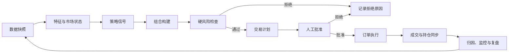
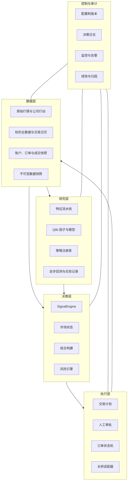
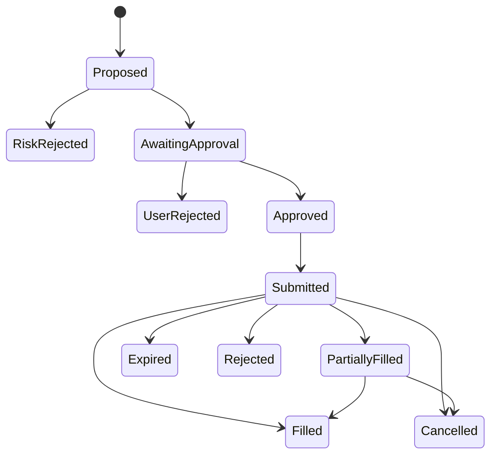

# 量化交易核心策略系统设计

> 版本：v0.1  
> 日期：2026-07-26  
> 状态：设计基线，尚未用于实盘下单  
> 首期市场：美股普通股票与非杠杆 ETF  
> 首期频率：日线决策、周线辅助  
> 首期执行：系统生成交易提案，人工批准后执行

## 1. 设计结论

首版采用一个可审计的模块化单体：

- Qlib 负责数据处理、因子、模型训练、滚动预测和实验记录；
- Vibe-Trading 的 `SignalEngine` 负责把规则或模型预测转换为统一的 `[-1, 1]` 信号；
- 独立的组合与风险引擎决定“能不能交易、允许承担多少风险”，不得由信号直接决定仓位；
- 独立的执行引擎把通过检查的交易计划转换为订单意图；
- 首期只生成待批准订单，不自动提交实盘；
- 每次决策都保存数据版本、策略版本、信号、风险数字、拒绝原因和最终成交结果。

系统的核心不是预测下一根 K 线，而是稳定完成以下闭环：



## 2. 系统目标

### 2.1 首要目标

1. 以费用后、滑点后的相对基准收益衡量策略，而不是只看累计美元利润。
2. 将每个交易决策归属到一个有版本的策略，形成可重复样本。
3. 在信号、仓位、组合风险和订单执行之间建立强制隔离。
4. 同时支持日线交易仓、周线核心仓和清仓后的规则化再入场。
5. 避免未来数据、幸存者偏差、过拟合和不真实的成交假设。
6. 实盘与回测使用尽可能相同的信号、风控和组合代码。

### 2.2 首期不做

- 高频、日内做市或依赖毫秒级延迟的策略；
- 自动提交实盘订单；
- 裸卖期权；
- 杠杆 ETF、反向 ETF 和做空；
- 用大语言模型直接输出买卖和仓位；
- 在样本外验证前使用复杂深度学习模型；
- 把单次盈利或单一标的的大额盈利视为策略优势。

这些能力未来可以作为受控插件加入，但不得绕过统一风险接口。

## 3. 设计原则

### 3.1 风险引擎拥有最终否决权

策略只能表达方向和置信度，不能自行决定最终持仓。任何交易都必须依次通过：

`Signal -> Portfolio Proposal -> Risk Decision -> Trade Plan -> Approval -> Order Intent`

### 3.2 先建立可解释基线，再引入机器学习

第一条生产级策略应是可解释的日线/周线趋势规则。只有当数据、回测、成本和执行链路稳定后，才用 Qlib Alpha158 + LightGBM 作为独立 alpha 模块与规则基线比较。

### 3.3 回测、模拟盘和实盘同源

同一个策略版本不得分别维护“回测版”和“实盘版”。差异只能存在于数据适配器、成交模拟器和券商适配器。

### 3.4 数据时点必须明确

每个信号必须记录 `as_of` 和 `available_at`。日线策略默认只能使用当日收盘后已经确定的数据，并在下一可交易时段执行，禁止用当日收盘价生成信号后又假设按同一收盘价成交。

### 3.5 所有规则配置化、版本化

均线周期、突破窗口、风险预算、持有期和执行时段都进入配置文件。参数变化必须产生新版本，旧回测不得被覆盖。

### 3.6 策略能力与部署权限分离

参考 QuantDinger 的 Strategy Manifest 思路，系统把策略声明与部署权限分开：

- `StrategyManifest` 声明策略需要的股票池、频率、字段、warm-up、基准、方向和最大产品能力；
- `DeploymentPolicy` 声明本次运行真正允许的市场、标的、方向、资金桶和风险额度；
- Deployment Policy 只能比 Strategy Manifest 更严格；
- 账户级风险配置独立存在，并拥有最终否决权；
- 源码、Manifest、Deployment Policy、数据快照和运行参数分别计算哈希。

不得因为策略源码声明“支持”某种产品或方向，就自动获得实盘权限。

## 4. 首版投资组合结构

系统将资金分为相互隔离的资金桶（sleeves）：

| 资金桶 | 作用 | 决策周期 | 首版状态 |
|---|---|---|---|
| 基准/核心仓 | 承担长期市场暴露，作为主动策略机会成本 | 周线 | 设计保留，比例待确认 |
| 主动交易仓 | 执行日线趋势、突破和再入场策略 | 日线 | MVP 核心 |
| 现金缓冲 | 承担风险预算和极端事件缓冲 | 每日 | 强制保留 |
| 特殊产品仓 | 期权、杠杆或反向 ETF | 独立规则 | 首版禁用 |

资金桶之间必须分别计算收益、回撤、换手、费用和对基准的贡献。不得用核心仓盈利掩盖主动策略亏损，也不得把亏损的交易仓临时改名为核心仓。

首版使用 SPY 作为主要比较基准，QQQ 作为成长风格参考基准。最终核心仓比例和复合基准权重需要在实施前由用户确认，不能由系统根据近期涨跌临时调整。

## 5. 首个策略族：双周期趋势与再入场

策略族名称：`dual_horizon_trend_v1`

它不是一条混合规则，而是共享数据与风控的三个独立子策略。三者必须分别统计样本和绩效。

### 5.1 周线核心趋势 `weekly_core_trend`

候选多头条件：

- 周收盘高于向上的 10 周均线；
- 10 周均线高于 30 周均线；
- 标的通过流动性、可交易性和公司行动检查。

退出分层：

- 首次周收盘跌破 10 周均线：触发减仓候选；
- 连续两周收盘低于 10 周均线、10 周均线转为下降，或跌破预定义周线结构：触发退出候选；
- 发生基本面断裂或交易状态异常时，硬风险规则优先。

### 5.2 日线交易趋势 `daily_trend`

入场候选条件：

- 收盘突破此前 20 个完整交易日最高价；
- 20 日均线向上；
- 周线状态不是明确空头；
- 当日数据完整且没有公司行动污染；
- 次日开盘跳空未超过配置阈值，否则进入等待状态。

退出与止盈：

- 入场前必须生成失效价和最大持有期；
- 硬止损与结构止损取更严格者；
- 趋势仍强时，计划止盈默认生成 15%–25% 的尾仓候选；
- 尾仓在连续两个日线收盘低于 20 日均线或跌破结构低点时退出。

### 5.3 清仓后再入场 `daily_reentry`

- 每次清仓自动进入 60 个交易日观察池；
- 再入场触发使用“突破此前 20 日最高价且 20 日均线向上”的独立事件；
- 首次再入场只申请正常风险预算的一半，并受账户级单笔风险上限约束；
- 只有形成更高低点后的再次突破，或周线重新确认，才允许申请完整风险预算；
- 再入场必须生成新的交易 ID，不能与原交易合并以美化盈亏。

### 5.4 双层信号契约

研究层的原始输出统一为：

```python
Dict[str, pd.Series]  # symbol -> signal，值域 [-1.0, 1.0]
```

推荐语义：

| 信号范围 | 含义 |
|---:|---|
| `0.60` 至 `1.00` | 强多头候选 |
| `0.20` 至 `0.60` | 弱多头或观察 |
| `-0.20` 至 `0.20` | 空仓/中性 |
| `-1.00` 至 `-0.20` | 首版不用于开空，只用于降低或退出多头 |

`SignalEngine.generate(data_map)` 只处理传入数据，不在内部访问网络、券商或账户状态。账户风险和最终仓位由后置模块处理。

连续信号在通过组合和风险引擎后，转换为规范化交易动作：

```text
AlphaSignal[-1, 1]
    -> PositionProposal
    -> RiskDecision
    -> CanonicalTradeAction
    -> OrderIntent
```

规范化动作包括：

```text
open_long / add_long / reduce_long / close_long
open_short / add_short / reduce_short / close_short
```

首版部署政策只允许多头动作。退出多头和建立空头是两个独立动作，目标仓位从正数变成零不得自动反转成负数。

## 6. Qlib 模型层的定位

Qlib 首期不是交易系统本身，而是一个可替换的 alpha 工厂：

1. 使用规则策略建立基准；
2. 使用 Alpha158 生成特征；
3. 使用 LightGBM 预测未来固定窗口的横截面收益或排名；
4. 将 `pred_score` 按交易日做截面排序并映射到 `[-1, 1]`；
5. 把模型信号作为独立策略运行，或在有充分样本后作为规则信号的排序器；
6. 任何模型都必须经过滚动训练和样本外评估。

禁止直接把全样本训练后的预测用于同期回测。训练、验证、测试和最终保留集必须按时间切分；标准化、缺失值处理和股票池筛选也必须遵守时点。

## 7. 系统模块



### 7.1 数据层

职责：

- 保存原始 OHLCV、复权因子、拆股、分红、停牌、交易日历和标的主数据；
- 保存券商账户净值、现金、持仓、未完成订单、订单和成交；
- 校验时区、重复行、缺失值、异常价格和复权连续性；
- 每次研究或实盘决策绑定不可变数据快照 ID。

首版存储：

- Parquet：不可变的大表和回测产物；
- DuckDB：本地查询、质量检查和绩效归因；
- Qlib Provider：因子和模型数据接口；
- YAML：策略与风控配置；
- JSONL 或 DuckDB 表：事件与决策审计日志。

当前 Qlib CN 示例数据止于 2020-09-25，只能用于环境验证，不得作为美股首版系统的生产数据源。

### 7.2 特征与市场状态层

职责：

- 生成日线和周线特征；
- 明确每个特征的可用时间；
- 给出市场状态，例如趋势、多空、波动率和流动性状态；
- 将规则因子与 Qlib 特征隔离，便于单独消融测试。

首版特征至少包括：

- 20/60 日均线、10/30 周均线及斜率；
- 20 日突破、ATR、历史波动率、跳空幅度；
- 成交额、价差代理和缺失交易日；
- SPY/QQQ 相对强弱；
- 行业/主题标签及相关性。

### 7.3 策略注册表

每个策略必须登记：

- `strategy_id`、版本和负责人；
- 市场、股票池、频率和基准；
- 输入字段、信号定义和参数；
- 允许的产品类型和方向；
- 仓位类型；
- 失效、退出、尾仓和再入场规则；
- 风险预算引用；
- 训练区间、验证区间、测试区间；
- 当前生命周期状态。

生命周期固定为：

`idea -> research -> validated -> paper -> shadow -> limited_live -> live -> retired`

生命周期只能前进一格；发现数据泄漏、重大实现差异或异常绩效时可直接退回 `research` 或 `retired`。

### 7.4 组合构建

组合构建把信号转换为目标风险，而不是直接按信号线性满仓：

1. 过滤不可交易和数据不合格的标的；
2. 根据信号强度和策略资金桶形成候选；
3. 使用止损距离和风险预算计算初始仓位；
4. 应用单标的、行业、主题、相关性和总暴露限制；
5. 应用换手与最小交易金额约束；
6. 输出目标仓位与现有仓位的差值。

普通多头仓位的基础计算：

```text
单股风险 = 计划入场价 - 止损价
风险预算金额 = 账户净值 × 该策略允许的单笔风险比例
初始数量 = floor(风险预算金额 / 单股风险)
最终数量 = min(初始数量, 单标的上限, 主题上限, 现金约束)
```

如果止损价无效、风险为零、行情时间过旧或缺少当前净值，系统必须拒绝计算，不能猜测数量。

### 7.5 风险引擎

风险引擎分三层：

#### 交易级

- 入场、失效、止损、止盈和最长持有期是否完整；
- 最大亏损金额和占净值比例；
- 是否为再入场、日线交易仓或周线核心仓；
- 是否使用特殊产品；
- 是否触发跳空追价、盘前盘后或开盘后 30 分钟限制。

#### 组合级

- 单标的、行业、主题和同方向合并风险；
- 总毛暴露、净暴露、现金下限和组合预期损失；
- 高相关标的的集中风险；
- 同一主题多空冲突；
- 当日与当周新增风险次数。

#### 账户级

- 当日、当周和峰值回撤；
- 连续亏损和策略失效状态；
- 数据延迟、券商状态和持仓对账差异；
- 紧急停止开关。

所有限制分为：

- `HARD_BLOCK`：禁止生成可执行订单；
- `REQUIRE_APPROVAL`：需要额外人工说明；
- `WARN`：保留警告但不阻断；
- `PASS`。

风控返回结构化原因码，禁止只返回自由文本。例如：

```text
RISK_MISSING_NAV
RISK_THEME_CONCENTRATION
RISK_OPENING_30M
RISK_REENTRY_NOT_CONFIRMED
RISK_ORDER_CHASING
RISK_LEVERAGED_PRODUCT_DISABLED
```

### 7.6 执行引擎

首版只接收已经通过风险引擎并由用户批准的 `TradePlan`。

订单状态机：



执行约束：

- 订单意图具有幂等键，重试不能重复下单；
- 默认使用限价单；
- 每次改单必须引用原交易计划并记录原因；
- 超过最大改单次数或价格偏离阈值后自动转为取消，不继续追价；
- 订单过期后必须重新获取行情并重新通过风险检查；
- 券商持仓是实盘事实来源，但内部账本必须每日对账；
- 平仓不得因数量错误意外建立反向仓位。

## 8. 核心领域对象

| 对象 | 关键字段 |
|---|---|
| `DataSnapshot` | `snapshot_id`, `as_of`, `available_at`, `source_versions`, `quality_status` |
| `StrategyManifest` | `code_hash`, `universe`, `subscriptions`, `benchmark`, `warmup`, `capabilities` |
| `DeploymentPolicy` | `allowed_markets`, `allowed_actions`, `risk_profile`, `approval_mode` |
| `ClockPolicy` | `signal_bar_end`, `eligible_execution_at`, `market_timezone`, `closed_bar_only` |
| `StrategySpec` | `strategy_id`, `version`, `universe`, `benchmark`, `parameters`, `lifecycle` |
| `SignalEvent` | `strategy_run_id`, `symbol`, `timestamp`, `signal`, `reason_codes` |
| `PositionProposal` | `symbol`, `sleeve`, `target_qty`, `entry`, `stop`, `risk_amount` |
| `RiskDecision` | `status`, `rule_results`, `max_loss`, `combined_risk`, `expires_at` |
| `TradePlan` | `plan_id`, `strategy_id`, `position_type`, `entry_zone`, `exit_plan`, `max_holding` |
| `OrderIntent` | `intent_id`, `plan_id`, `side`, `qty`, `limit_price`, `idempotency_key` |
| `OrderLedgerEntry` | `requested_qty`, `filled_qty`, `remaining_qty`, `state`, `reason_code` |
| `BrokerOrder` | `broker_order_id`, `state`, `submitted_at`, `fills`, `fees` |
| `PositionLot` | `strategy_id`, `sleeve`, `entry_time`, `qty`, `cost`, `stop`, `runner_flag` |
| `ProtectionState` | `lot_id`, `structure_stop`, `trailing_state`, `time_limit`, `high_watermark` |
| `RuntimeLease` | `owner_id`, `fencing_token`, `heartbeat_at`, `expires_at` |
| `StrategyRun` | `code_version`, `config_hash`, `data_snapshot_id`, `artifacts`, `metrics` |

每个持仓批次必须携带 `strategy_id` 和 `sleeve`。同一股票由不同策略持有时，组合风险合并计算，绩效归因分别保存。

## 9. 回测与验证协议

### 9.1 必须模拟的现实约束

- 复权与公司行动；
- 信号生成时点与下一时段成交；
- 手续费、平台费、交易税、买卖价差和滑点；
- 停牌、无成交、涨跌停或无法成交状态；
- 整股数量、最小订单金额和现金占用；
- 限价未成交、部分成交和订单过期；
- 股票池的历史成分，避免只使用当前幸存者。

事件时序固定为：

1. 当前已完成 K 线成为策略可见数据；
2. 策略在 K 线结束后产生信号；
3. 风险检查计算最早可执行时间；
4. 日线信号默认在下一可交易时段执行；
5. 重复接收同一根已完成 K 线不得重复生成订单；
6. `signal_bar_end` 与 `eligible_execution_at` 必须进入订单审计记录。

成交和账户还必须满足：

- 平仓数量不得超过对应方向的可用持仓；
- 没有明确匹配的开仓 lot，不得确认平仓 PnL；
- 持仓必须等于成交净和；
- 现金变化必须能由成交、费用和公司行动解释；
- 内部持仓与券商持仓不一致时停止新增风险；
- 会计错误只能通过显式更正事件修复，不能静默覆盖历史。

### 9.2 数据划分

规则策略也要保留最终测试集。机器学习使用：

- 训练窗口；
- 验证窗口；
- 严格后移的测试窗口；
- 滚动或扩展窗口的 walk-forward；
- 最终一次性打开的保留集。

参数选择只能依据训练和验证结果。测试集和保留集失败时，不得继续调参后仍把它称为样本外结果。

### 9.3 报告指标

绝对指标：

- CAGR、年化波动率、最大回撤、Calmar、Sharpe、Sortino；
- 胜率、盈亏比、Profit Factor、连续亏损、持有期；
- 换手率、成交率、费用、滑点和现金利用率。

相对指标：

- 对 SPY 的费用后超额收益和信息比率；
- 对 QQQ 的风格敏感性；
- 上涨、下跌和横盘市场的分段表现；
- 主动仓对组合收益和回撤的边际贡献。

稳定性指标：

- 按年份、市场状态、行业和标的的表现；
- 前 1、3、5 个盈利标的对总利润的贡献；
- 参数邻域稳定性；
- 不同成本假设下的结果；
- 训练、验证、测试和模拟盘之间的衰减。

### 9.4 首次晋级标准

策略从 `research` 进入 `paper` 前至少满足：

1. 无未来数据、股票池幸存者偏差和同收盘成交问题；
2. 样本外费用后期望值为正；
3. 相对主要基准的结果有明确解释；
4. 至少 20 个同规则交易样本，且不能由单一标的决定结论；
5. 前三大盈利交易或标的剔除后，策略结论不发生完全反转；
6. 参数轻微变化后仍保持同方向结果；
7. 加倍滑点后没有出现不可接受的崩溃；
8. 风险、退出、尾仓和再入场逻辑在回测中真实执行。

20 个样本只是最低流程门槛，不代表统计显著，也不自动允许扩大仓位。

从 `paper` 进入 `limited_live` 还必须满足：

- 至少一个固定观察窗口的模拟盘结果；
- 模拟信号和回测代码一致；
- 每日数据质量、对账和告警运行正常；
- 所有风险阻断规则有自动化测试；
- 用户明确批准策略版本与实盘风险配置。

## 10. 监控与复盘

### 10.1 每日

- 数据是否按时、完整、无异常；
- 当日信号、被拒绝信号及原因；
- 当前持仓、止损、最长持有期和观察池；
- 内部账本与券商持仓是否一致；
- 是否出现策略外持仓或手工订单。

### 10.2 每周

- 主动仓相对 SPY/QQQ 的费用后收益；
- 每个策略的样本数、期望值和回撤；
- 规则外交易次数；
- 取消、过期、拒绝和改单次数；
- 单一标的、主题和大赢家的利润集中度；
- 日线交易仓、周线核心仓和尾仓的归因。

### 10.3 自动降级与停止

以下条件触发停止新增风险，具体阈值在实施阶段配置：

- 数据质量为阻断状态；
- 券商对账失败；
- 策略实盘行为与回测行为不一致；
- 回撤或连续亏损超过策略风险额度；
- 实际滑点持续显著高于压力测试；
- 订单取消/追价频率异常；
- 模型输入分布发生显著漂移。

停止新增风险不等于强制市价平仓；现有持仓按预先定义的退出规则管理，除非触发账户级紧急规则。

## 11. 建议代码结构

```text
invest/
├── AGENTS.md
├── README.md
├── docs/
│   ├── architecture/
│   ├── strategy_specs/
│   └── runbooks/
├── config/
│   ├── environments/
│   ├── risk/
│   ├── strategies/
│   └── universes/
├── src/invest/
│   ├── data/
│   ├── features/
│   ├── regimes/
│   ├── strategies/
│   ├── qlib_bridge/
│   ├── signal_engine/
│   ├── portfolio/
│   ├── risk/
│   ├── execution/
│   ├── brokers/longbridge/
│   ├── backtest/
│   ├── accounting/
│   └── monitoring/
├── tests/
│   ├── unit/
│   ├── integration/
│   ├── regression/
│   └── lookahead/
├── data/
│   ├── raw/
│   ├── curated/
│   └── snapshots/
├── artifacts/
│   ├── experiments/
│   ├── backtests/
│   └── reports/
└── scripts/
```

`data/` 和 `artifacts/` 中的大文件默认不进入 Git。代码、配置、数据清单、质量报告和结果摘要进入版本控制。

## 12. 实施阶段

### Phase 0：冻结需求与风险政策

交付：

- 明确交易市场、标的池、主要基准和资金桶；
- 确认普通股票的单笔、主题、组合和回撤风险上限；
- 确认数据源、执行时段和人工审批方式；
- 把历史复盘规则转换为结构化风险配置。

验收：任何风险数字都能找到唯一配置来源，且不存在策略自己覆盖风险上限的路径。

### Phase 1：最小研究闭环

交付：

- 标准化日线/周线数据；
- 数据质量报告和不可变快照；
- `dual_horizon_trend_v1`；
- 成本真实的回测；
- SPY/QQQ 基准和策略报告；
- 全部核心风控单元测试。

验收：固定配置重复运行产生相同结果；不存在同收盘成交和明显未来数据。

### Phase 2：Qlib alpha 工厂

交付：

- Alpha158 + LightGBM 滚动训练；
- `pred_score -> SignalEngine` 适配；
- 模型、规则和组合策略的独立比较；
- 实验与模型版本记录。

验收：每个预测都能追溯到训练窗口、数据快照、代码版本和配置哈希。

### Phase 3：模拟盘与影子运行

交付：

- 每日自动生成信号和交易计划；
- 读取长桥账户和行情，但不提交订单；
- 对账、监控、告警和周报；
- 记录用户批准/拒绝以及假设成交。
- 独立的单一 `trading-worker` 拥有长桥会话和订单状态；
- 使用 runtime lease、heartbeat 和 fencing token 防止进程重启后重复执行；
- HTTP、CLI 或 MCP 只提交持久化命令，不直接持有交易循环。

验收：连续运行一个固定观察窗口，无漏数、重复计划、重复订单意图或无法解释的持仓差异。

### Phase 4：受限实盘

交付：

- 仅开放已经批准的策略和普通多头产品；
- 极小风险预算；
- 每单人工批准；
- 自动停止新增风险和恢复流程。

验收：实盘信号、计划、批准、订单、成交和归因形成完整审计链。

## 13. 首版验收清单

- [ ] 信号不能绕过组合与风险引擎直接生成订单。
- [ ] 缺少净值、行情、止损或合并风险时必须拒绝交易计划。
- [ ] 日线交易仓与周线核心仓在开仓前固定。
- [ ] 清仓后自动进入 60 日观察池。
- [ ] 尾仓有独立数量、退出规则和归因。
- [ ] 特殊产品默认被禁用。
- [ ] 盘前盘后和开盘后 30 分钟的新风险受到阻断或显式审批。
- [ ] 单一主题的同方向风险被合并计算。
- [ ] 回测包含费用、价差、滑点和下一可交易时段成交。
- [ ] 当前收盘产生的信号不能按同一收盘价成交。
- [ ] 重复处理同一根已完成 K 线不会产生第二个订单意图。
- [ ] 订单幂等键有持久化唯一约束。
- [ ] 没有开仓 lot 时无法产生盈利平仓记录。
- [ ] 部分平仓、尾仓和再入场使用独立 lot 归因。
- [ ] 会计不变量失败时自动停止新增风险。
- [ ] 所有研究结果绑定数据快照、代码版本和配置哈希。
- [ ] 每个策略分别统计样本，不能按股票代码混合归因。
- [ ] 取消、过期、拒绝、改单和规则外交易进入周报。
- [ ] 实盘功能在用户明确批准前保持不可用。

## 14. 实施前需要冻结的决策

以下问题不会阻止架构设计，但会影响 Phase 0 配置：

1. 首期股票池：仅大型美股/ETF，还是包括高波动小盘股；
2. 主要基准：SPY，或 SPY/QQQ 的复合基准；
3. 核心仓、主动仓和现金的目标区间；
4. 普通股票的单笔最大风险、主题合并风险和账户最大回撤；
5. 行情与公司行动的生产数据源；
6. 每日生成信号的时间，以及允许执行的常规交易窗口；
7. 模拟盘的固定观察期；
8. 首版是否完全排除期权、杠杆 ETF 和反向 ETF。

这些决定应进入版本化配置，不应散落在代码或临时对话中。
